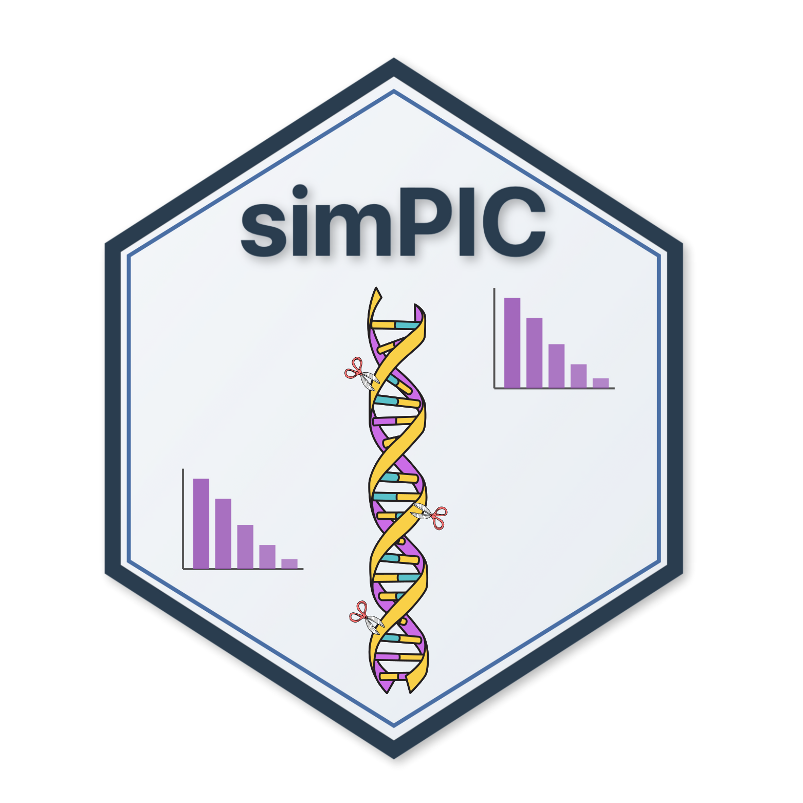

# simPIC

## Overview


simPIC is an R package for simple simulation of single-cell Assay for Transposase Accessible Chromatin sequencing (scATAC-seq) data. simPIC provides a an easy to use interface for:

* estimating simulation parameters
* Objects for storing those parameters
* simulating counts using those parameters

## Installation

The package can be installed from Bioconductor using the following code

```r
if(!requireNamespace("BiocManager", quietly=TRUE))
    install.packages("BiocManager")
BiocManager::install("simPIC")
```

## Getting started

To get started, check out the vignette for a quick start and detailed look into simPIC. If you prefer, you can also build the vignette yourself by loading simpIC and exploring the available options.

```r
library(simPIC)
browseVignettes("simPIC")
```


